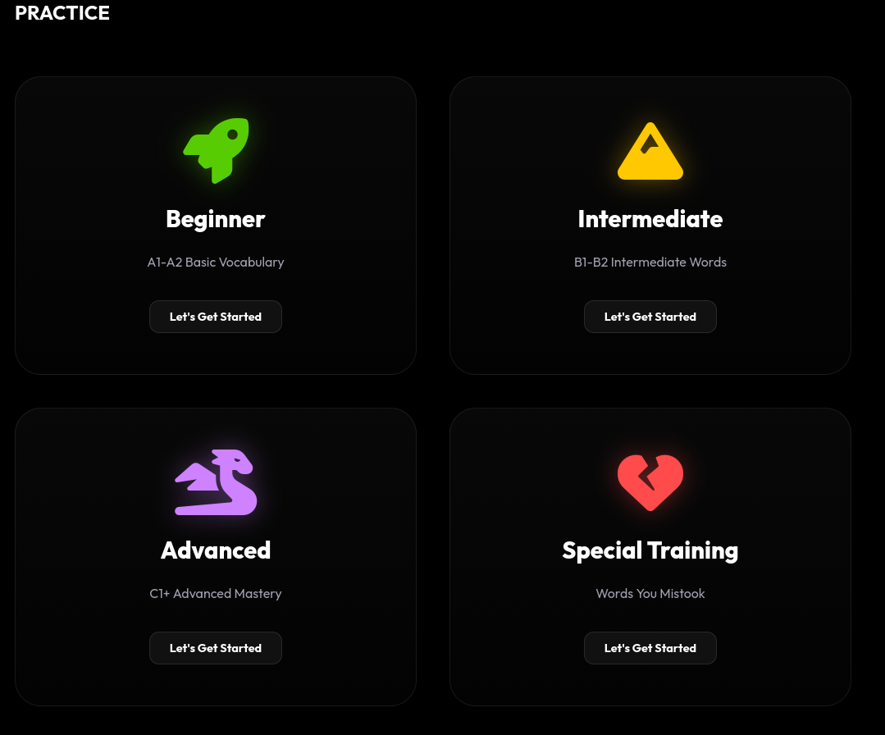

# LinguDeep 🧠🌍

A gamified, web‑based language‑learning platform for memorizing vocabulary across
**15+ languages** — with a leveled skill map, daily quests, leagues, a placement test,
and an adaptive question engine (multiple choice, audio, and sentence‑scramble).

🌐 **Live site:** [lingudeep.online](https://lingudeep.online)

[](https://lingudeep.online)




---

## ✨ Features
- 📖 Leveled curriculum (A1 → C2): 100+ chapters, 1500+ curated words
- 🧠 Adaptive question engine: multiple‑choice, listen‑and‑write, sentence scramble
- 🌐 Multi‑language: learn **to** any language **from** any language (EN, TR, ES, FR, DE, IT, PT, RU, JA, ZH, KO, AR, HI, NL, SV)
- 🔁 Spaced repetition via "Weak Points" practice
- 📊 Progress tracking: XP, streaks, daily quests, leagues & achievements
- 🗺️ Visual skill‑map with per‑section icons and language‑aware badges
- 🔊 Text‑to‑speech pronunciation for every word
- ☁️ Optional cloud sync via Firebase (works fully offline in guest/local mode)

---

## 🚀 How to Run
No build step and no server required.

1. Open `index.html` in any modern browser (Chrome, Edge, Firefox, Safari).
2. Pick your **interface language**, **native language**, and the **language you want to learn**.
3. Take the short placement test (or skip it) and start learning.

> Tip: an internet connection is used only for the translation API (to support
> learning a *third* language beyond English/Turkish) and the optional Font‑Awesome
> CDN icons. English↔Turkish courses and the whole UI work fully offline.

---

## 🗂️ Project Structure
```
index.html              App shell + static markup (loads everything from ./src)
src/
  app.js                Core app: LinguPro class, localization, question engine
  words.js              Vocabulary curriculum (levels → chapters → words)
  idioms.js             English idiom → meaning map
  sentences_curated.js  Curated example sentences
  firebase-config.js    Firebase init (graceful guest mode when unconfigured)
  style_new.css         Main styles
  index.css             Layout / component styles
  all.min.css           Local Font‑Awesome copy (fallback)
assets/                 Logo & screenshots
```

---

## ⚙️ Configuration

### Firebase
The app is configured with a Firebase project (`lingudeep-196e6`) via
`window.__FIREBASE_CONFIG__` in `index.html`. This enables email/password and
Google sign-in plus cloud progress sync (Firestore).

The client-side config (apiKey, projectId, …) is **public by design** — Firebase
secures data through **Security Rules**, not by hiding these values. Make sure
your **Firestore rules** are locked down so only authenticated users can read/write
their own data, e.g.:

```
rules_version = '2';
service cloud.firestore {
  match /databases/{database}/documents {
    match /users/{userId} {
      allow read, write: if request.auth != null && request.auth.uid == userId;
    }
  }
}
```

If you ever want to run without Firebase (e.g. a fully offline demo), simply
remove the `window.__FIREBASE_CONFIG__` block from `index.html` — the app then
falls back to a built-in **local account system** (email + password stored in
`localStorage`) and runs with no server at all.

---

## 🛠️ Recent Fixes
This revision repaired several bugs that broke the experience:

- **App wouldn't load at all** — every local CSS/JS reference in `index.html`
  pointed to the wrong path (e.g. `app.js` instead of `src/app.js`) and a
  `mobile-fix.css` file was referenced that didn't exist. All asset paths are
  corrected and the missing stylesheet reference removed.
- **Language mix‑ups in quizzes** (e.g. an Arabic/Turkish option appearing while
  learning English) — the distractor fallback in the question engine was injecting
  raw `en`/`tr` database words without translating or validating them against the
  learner's language. Options are now always translated to the expected language
  and passed through script/language guards before being shown; questions whose
  correct answer can't be rendered in the right language are skipped instead of
  leaking the wrong language. The placement‑test fallback got the same treatment.
- **Firebase crashed on load** — `firebase-config.js` used React‑style
  `process.env.*` variables that don't exist in a browser. It now reads an
  optional `window.__FIREBASE_CONFIG__` and otherwise runs in clean guest mode.
- **Untranslated static UI** — the mobile bottom‑nav, auth email/password
  placeholders, "Continue with Google" buttons, and the "Logged in as" label were
  hardcoded in Turkish; they are now wired into the localization system.
- **Section icons** — level/section cards now display a badge with the flag of the
  language being learned, so every section is visually specific to its language.

---

## 📜 License
See [LICENSE](./LICENSE).
